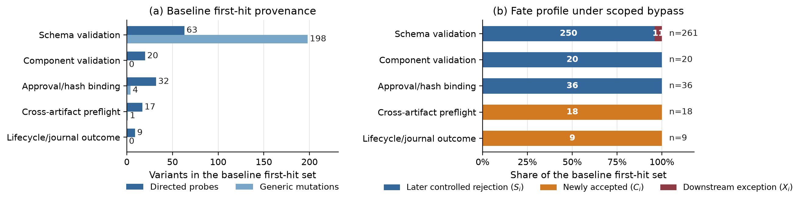

# Validator Fate Profiles

[](https://github.com/weich97/validator-fate-profiles/actions/workflows/verify.yml)

Short-circuit logs show where validation stopped. They do not show what changes
when that check is omitted. This repository releases the row-level evidence and
small verification tools behind a two-case study of that distinction.

The measurement separates three outcomes for every baseline first failure:

- **newly accepted** after the reported check is omitted;
- **rejected later** by another active check; and
- **downstream exception** after a controlled rejection is removed.

The later destination is retained rather than folded into a single catch-all
count.



## Main observations

- In the 365-variant artifact case, schema validation is the first refusal for
  261 of 344 rejected variants. Omitting that front call site admits none:
  250 variants are rejected later and 11 end in downstream exceptions.
- In an external transfer using 24 source mutants from `idna` 3.18, six mutants
  first fail at mypy. Omitting mypy admits four and moves two to pytest.

These are fixed-corpus observations, not estimates of natural defect
frequencies or rankings of validation tools.

## Verify the released evidence

The core verifier uses only the Python standard library and does not call a
network service:

```bash
python verify.py
```

It checks the release manifest, recomputes both case summaries from row-level
ledgers, verifies the two external repeats, and binds the reported claims,
references, and figure to the included technical-note source.

## Rebuild the figure

Use Python 3.12 and the pinned plotting environment:

```bash
python -m pip install -r requirements/figure.txt
python verify.py --render-figure
```

The renderer reads:

- `evidence/artifact_case/e1_source_matrix.csv`
- `evidence/artifact_case/e1_leave_one_out.csv`

and regenerates both `report/figures/attribution_gap.pdf` and
`report/figures/attribution_gap.png`. The PDF is required to match the released
hash in the pinned environment.

## Build the technical note

The report is an open technical note, not a peer-reviewed publication. With a
TeX distribution that provides `pdflatex` and `biber`:

```bash
python scripts/build_report.py
```

The generated PDF is `report/technical_note.pdf`; its source is
`report/technical_note.tex`, with references in `report/refs.bib` and the sole
generated figure supplied with its renderer and source tables.

To rebuild in a temporary directory and require byte identity with the released
PDF under the recorded release toolchain, run:

```bash
python verify.py --build-report
```

The recorded TeX/Biber environment is in
`provenance/report-build-environment.md`. Other compatible TeX
distributions should reproduce the content and layout, but are not expected to
produce identical PDF bytes.

## Build the release archive

After rebuilding the manifest with `python scripts/build_manifest.py`, create a
deterministic release archive and checksum file with:

```bash
python scripts/build_release.py
```

The outputs are written under `dist/`. Repeated builds from an unchanged tree
produce the same archive bytes.

## Evidence levels

1. **Claim replay:** `python verify.py` recomputes the released findings from
   sanitized row-level evidence.
2. **Figure replay:** `python verify.py --render-figure` regenerates the only
   generated PDF figure.
3. **Report replay:** `python verify.py --build-report` rebuilds the technical
   note and compares it with the released PDF under the recorded toolchain.
4. **Experiment provenance:** the external-case directory preserves the frozen
   plan, mutation catalog, environment locks, manifests, two complete ledgers,
   and the reporting-only amendment.

The artifact case does not include the larger application that originally
generated its fixtures, so this release supports evidence replay rather than a
from-scratch rerun of that case. The external case uses the independently
maintained `idna` 3.18 release, but its four-command Windows sequence is an
experimental projection rather than the complete upstream workflow. The
campaign runner and upstream source/test tree are not vendored here, so this
release also does not provide a one-command full rerun of the external campaign.

## Repository relationship

The artifact case was developed in the broader
[TreLLM-public](https://github.com/weich97/TreLLM-public) project. This focused
repository gives the study its own evidence version, issue tracker, and
citation without coupling it to the software package's release numbering. The
link is contextual: this repository does not release the exact historical
application snapshot, fixture manifest, or generator that produced the
artifact-case rows.

## Citation and licenses

Citation metadata are in `CITATION.cff`. The root MIT License covers original
material in this repository. Token-level excerpts, mutation descriptors, and
diagnostic material derived from `idna` remain subject to its BSD-3-Clause
License under `evidence/external_case/IDNA_LICENSE.md`; see
`THIRD_PARTY_NOTICES.md`.

## Scope

The repository does not claim that first-failure counts are useless. They are
useful provenance. The narrower result is that provenance alone does not
identify admission changes or downstream fates under a stated omission.
